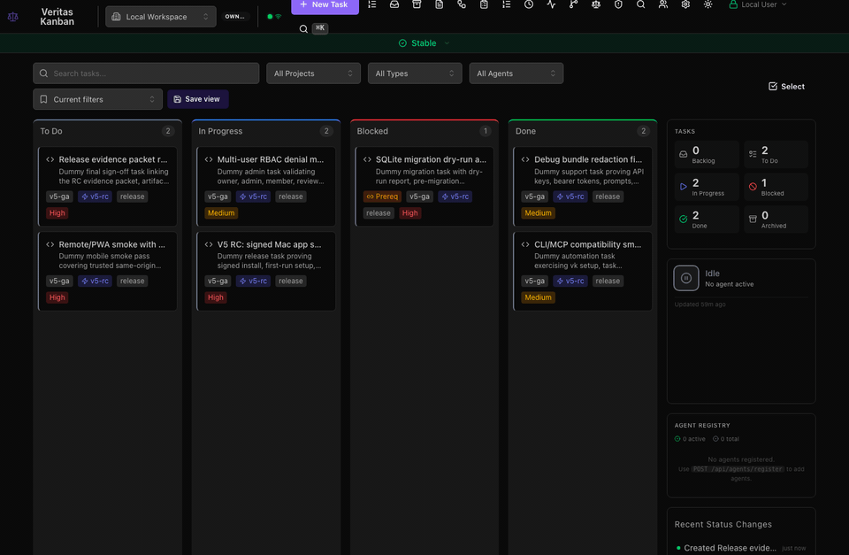
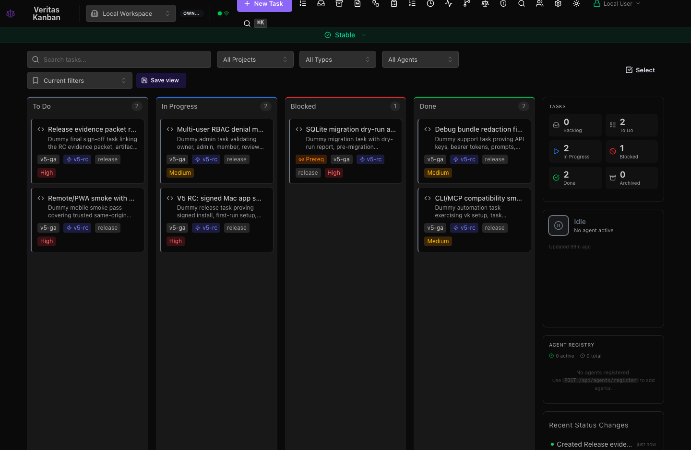
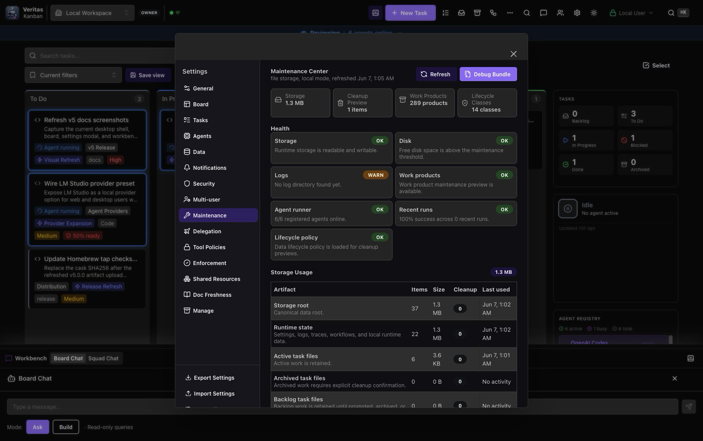
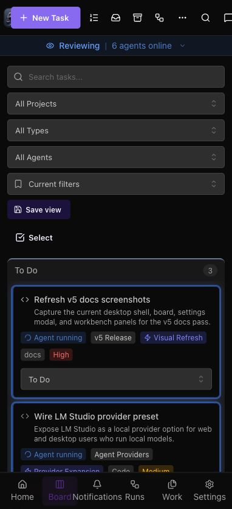
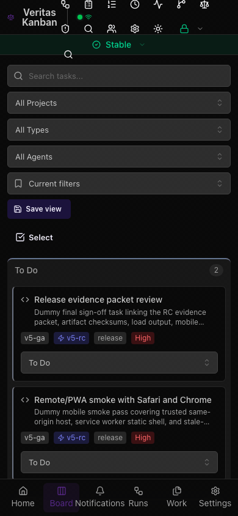

# Veritas Kanban v5 Visual Tour

This page is the v5 documentation media index. The screenshots and GIFs use
release-safe dummy content captured from the current app surfaces so the docs
can show realistic workflows without exposing real tasks, prompts, logs, paths,
tokens, or customer data.

## Capture Set

| Asset                  | Path                                       | Notes                                                                           |
| ---------------------- | ------------------------------------------ | ------------------------------------------------------------------------------- |
| Board to workflow tour | `docs/assets/v5/v5-board-to-workflow.gif`  | Desktop board, task detail, Workflows, and Decision Audit Trail flow.           |
| Board overview         | `docs/assets/v5/v5-board-overview.png`     | Current dark-mode board with v5 dummy tasks.                                    |
| Task work view         | `docs/assets/v5/v5-task-work-view.png`     | Task detail drawer with dummy v5 release smoke content.                         |
| Maintenance Center     | `docs/assets/v5/v5-maintenance-center.png` | Operator diagnostics, storage, cleanup preview, and redacted evidence surfaces. |
| Mobile/PWA board       | `docs/assets/v5/v5-mobile-pwa-board.png`   | Phone-width board shell with mobile navigation.                                 |
| Mobile/PWA flow        | `docs/assets/v5/v5-mobile-pwa-flow.gif`    | Mobile board, Runs, and Settings navigation flow.                               |

## Desktop Board And Workflow

The desktop tour shows the current board chrome, seeded release tasks, task
detail drawer, workflow route, and decision audit route. It is intentionally
dummy data, but it uses the real web app and a throwaway local server.

## Task Work View

The task work view capture uses a dummy signed Mac app smoke task. It exists to
show the current detail drawer, tabs, release-task metadata, subtasks, and done
criteria layout in v5 docs.

## Maintenance Center

The Maintenance Center capture uses mocked, redacted support data for health
checks, storage usage, cleanup preview, log tails, backup/import controls, and
lifecycle policy. No real local paths or tokens are included.

## Mobile/PWA

The mobile captures show the responsive board and bottom navigation for trusted
mobile/PWA access. They do not claim native offline execution; v5 PWA offline
behavior remains static-shell-only as documented in the release notes and admin
guide.

## Documentation Use

Use this page when completing:

- [v5 GA Checklist](V5-GA-CHECKLIST.md)
- [v5 Upgrade, Install, Remote, And Admin Guide](V5-UPGRADE-INSTALL-ADMIN-GUIDE.md)
- [v5.0 Release Notes](V5-RELEASE-NOTES.md)

These dummy captures are documentation assets, not release proof. Future
release-candidate evidence belongs in the reusable
[v5 Release Candidate Evidence Packet](V5-RC-EVIDENCE-PACKET.md) or the linked
GitHub release issue for that candidate.
